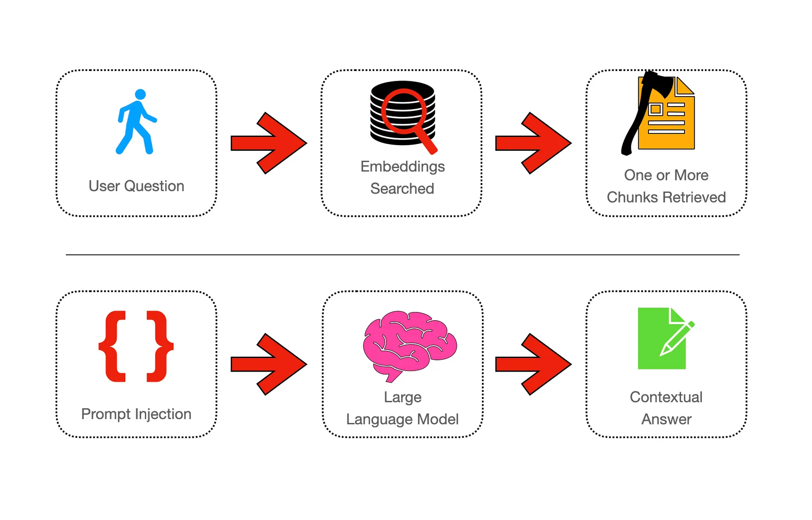
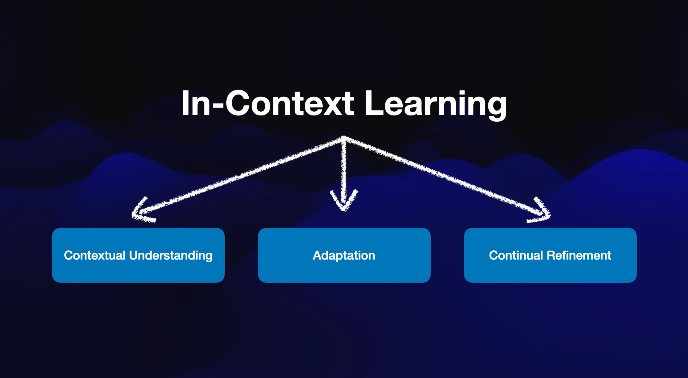
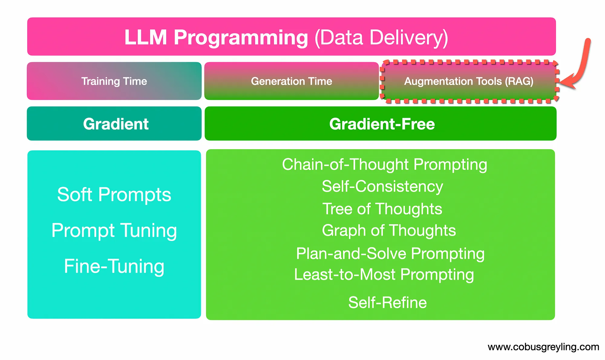

# [A Short History of RAG](https://cobusgreyling.medium.com/a-short-history-of-rag-d2935a2fea29)



## イントロ

現在、大規模言語モデルに関する最も人気のあるテーマの一つは、「検索強化生成（Retrieval Augmented Generation, RAG）」のアイデアです。RAGはいくつかの理由で重要ですが、この記事ではまず、RAGの人気が高まった原因について議論します。そして、最も基本的な形でのRAGの説明を行います。

## なぜRAGが必要か

### エマージェント(創発)機能

少し前から、LLM（大規模言語モデル）は「創発機能」と呼ばれるものを持っていると見なされていました。創発機能とは、モデルがユーザーやタスクとのやりとりの中で示す予期せぬ、または以前には予見されなかった機能のことです。

LLMにおける創発機能には次のようなものがあります：

- **問題解決**：LLMは、言語の理解と推理能力を活かし、明示的に訓練されていないタスクに対して洞察に満ちた解決策やアプローチを提供することで、問題解決能力を示すことがあります。
- **ユーザー入力への適応**：LLMは、特定のユーザー入力や文脈に応じてその反応を適応させ、やり取りのダイナミクスに基づいて出力にパーソナライゼーションやカスタマイズを示します。
- **文脈理解**：LLMは文脈の繊細な理解を示し、プロンプトに明示的に記述されていない場合でも、与えられた文脈に適切かつ適切な反応を生成することができます。

創発機能の現象は、組織がこれまで知られていなかったLLMの機能を発見しようとする動きにつながりました。

**しかし、[創発機能という概念は幻想であることが証明されました](https://www.wired.com/story/how-quickly-do-large-language-models-learn-unexpected-skills/)**

最近の研究では、創発機能という考え方が幻想であるとされ、実際には、一般的にLLMが文脈を与えられたときに非常にうまく応答するという事実が、創発能力と見なされていたことがわかりました。

### 指示と文脈参照

推論時に指示に基づいてLLMはうまく反応します。また、プロンプトに文脈参照データが注入されたとき、LLMは非常にうまく反応することがわかっています。多くの研究によって、推論時に提供される文脈知識が、モデルがファインチューニングされたデータよりも優先されることが実証的に証明されています。

### 文脈内学習
文脈内学習は、ユーザーや現在のタスクから提供される特定の文脈に基づいて、モデルがその反応を適応させて洗練する能力を指します。

このプロセスにより、モデルは操作している文脈を考慮して、より関連性が高く、一貫性のある出力を生成することが可能になります。



### 勾配を用いないアプローチ

LLMをプログラミングする方法には二つのアプローチがあります。LLMをプログラミングする別の方法として、データをLLMにどのように提供するかという視点があります。

データの提供は、勾配を用いるか勾配を用いないかのどちらかです。



大規模言語モデル（LLM）の訓練の文脈において、勾配ベースのアプローチと勾配フリーのアプローチの違いは、訓練過程でモデルのパラメータがどのように更新されるかにあります。

**勾配ベースのアプローチ**

勾配ベースのアプローチでは、モデルのパラメータは反復的に更新されます。例えば、モデルのファインチューニングを通じてです。
勾配ベースの最適化手法は、損失ランドスケープの滑らかさを利用し、パラメータを効率的に更新して最適な解に収束させるため、LLMの訓練に広く使用されています。

**勾配フリーのアプローチ**

対照的に、勾配フリーの最適化手法は、勾配（ファインチューニング）に依存せずにモデルのパラメータを更新します。代わりに、勾配情報を必要としないヒューリスティック検索アルゴリズムを使用してパラメータ空間を探索します。
勾配フリーのアプローチの場合、特定のモデルに投資はされず、開発された構造や手法はLLMの外に位置します。

## 最も単純な形でのRAG例

明らかな理由から、LLMが抱える二つの障害は以下の通りです：

1. LLMは知識集約型であるにもかかわらず、モデルは訓練された知識の範囲外の知識を持っておらず、モデルのカットオフ日が存在します。
2. モデルには、正確で簡潔な回答を生成するために、質問の文脈を与える必要があります。

下記のOpenAIとの会話を参照してください。非常に文脈依存の質問がGPT-4に投げかけられていますが、それは明らかに理解できない内容であり、GPT-4はそのように回答しています。

```
指示: 次の質問にできるだけ正確に答えてください。
質問: 多くの議論の末、どのような決定が下されましたか?
答え：
人工知能として、私があなたの質問に正確に答えるための特定の決定に関する情報にアクセスすることはできません。
```

以下の例では、同じ高度に文脈依存の質問がされています。

先の例では、文脈がないと質問はあいまいで本当に答えることが不可能ですが、ここでは指示と文脈の部分が手動で作成されたRAGプロンプトが使用され、生成を増強します。そして最後に質問がされます。この時、LLMは文脈を参照して質問に正確に答えます。

```
指示：このプロンプトで提供される文脈を使用して、以下の質問に答えてください。
文脈：
1924年冬季オリンピックは、正式にはオリンピック冬季競技大会として知られ、一般にシャモニー1924として知られています。
これは1924年にフランスのシャモニーで開催された冬季の複数スポーツイベントでした。
当初は1924年夏季オリンピックと関連して開催され、スポーツ競技は1月25日から2月5日までの間、
フランスのオート＝サボア県シャモニー、モンブランの麓で行われました。
この大会はフランスオリンピック委員会によって組織され、最初は「国際冬季スポーツ週間」として認識されていました。
イベントの成功を受け、国際オリンピック委員会（IOC）によって事後的に第一回オリンピック冬季競技大会と指定されました。
冬季オリンピックを夏季オリンピックと同じ年に開催する伝統は1992年まで続き、その後、夏季オリンピックの翌々年に
冬季オリンピックを開催する現行の習慣が始まりました。
フィギュアスケートはロンドンとアントワープでオリンピック競技とされており、
アイスホッケーもアントワープで競技とされていましたが、冬季スポーツは常に季節に制限されていました。
1921年、ローザンヌでのIOCの会議で、冬季スポーツの平等を求める声が上がり、多くの議論の後、
1924年にシャモニーで冬季スポーツの国際週間を開催することが決定されました。
質問：多くの議論の後、どのような決定がされましたか？

回答：1924年にシャモニーで冬季スポーツの国際週間を開催することが決定されました。
```

上記の例では、生成が拡張されていますが、文脈は手動で入力され、自動化された方法では取得されていません。

企業グレードの設置においては、プロンプトに文脈を挿入または注入することが自動化される必要があります。文脈は推論時にリアルタイムで取得され、プロンプトに挿入されます。

二つ目の課題は、速度と遅延を除いて、文脈スニペットがユーザーの文脈に非常に関連している必要があるということです。

そして、スニペットは最適なサイズである必要があります。サイズは次の点を考慮する必要があります：

1. ユーザーをスケーリングする際の帯域幅における遅延とオーバーヘッド
2. LLMの入力トークン使用を最適化すること。これはコストの観点から決定的な要因となります。

文脈ピースはチャンクと呼ばれます。したがって、文脈参照として機能する必要があるデータのコーパスは、これらの文脈参照スニペットに分割される必要があります。

さらに、正確な文脈のチャンクのテキストを取得し、プロンプトに挿入するために、何らかの意味検索が実行される必要があります。

### プロンプトインジェクション

```
qa_prompt_tmpl_str = """\

Context information is below.

---------------------
{context_str}
---------------------

与えられた文脈情報に基づいて、さまざまなトピックに関する引用についての質問に答えてください。
引用として著者のリストを含む構造化されたJSON形式で回答を提供してください。
以下にいくつかの例を示します。

{フューショット例}

Query: {質問クエリ}

Answer: \

"""
```

## 結論

大規模言語モデル（LLM）にとっての文脈の重要性は、与えられた状況やタスクに適切で、一貫性があり、関連性のある方法で言語を理解し生成する能力にあります。

文脈は、LLMによる言語の解釈と生成を形作るための必要な背景情報と手がかりを提供します。

全体として、文脈はLLMの指導的な枠組みとして機能し、人間のコミュニケーションの複雑さを反映する方法で言語を理解し、解釈し、生成することを可能にします。

文脈をモデルに取り入れることによって、研究者や開発者は多岐にわたるアプリケーションや領域におけるLLMの能力と効果を向上させることができます。
